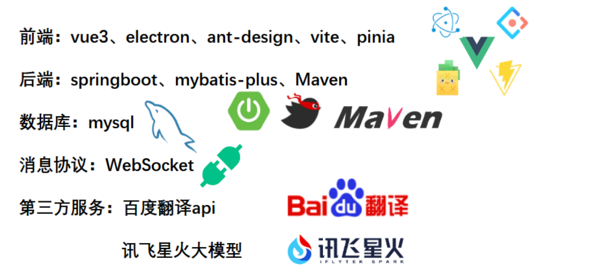

# 仿微信聊天系统（前端模块）
📱 **仿微信聊天系统** —— 研究生软件需求工程小组项目
## 目录
- [仿微信聊天系统（前端模块）](#仿微信聊天系统前端模块)
  - [目录](#目录)
  - [特性](#特性)
  - [运行前端](#运行前端)
  - [运行后端](#运行后端)
  - [项目技术栈](#项目技术栈)
  - [开发心得](#开发心得)
  - [功能实现细节](#功能实现细节)
  - [未实现功能](#未实现功能)
  - [自主创新](#自主创新)
  - [微信非聊天模块](#微信非聊天模块)
  - [反馈](#反馈)
## 特性
- **即时通讯**：消息发送与接收低延迟，沟通无界限。
- **多媒体消息**：支持发送表情，丰富聊天趣味。
- **用户界面**：界面简洁明了，交互流畅，贴近微信体验。
- **好友管理**：便捷的添加、删除与好友管理功能。

## 运行前端
确保您的系统已安装 Node.js。检查版本命令如下：
```bash
node -v # Node版本建议:version>=20.x
npm -v
```
克隆项目仓库并安装依赖：
```bash
git clone https://gitee.com/num_5/wechat_frontend
cd wechat_frontend
npm install
```
启动项目：
```bash
npm run dev #启动web端
npm run build #打包web端
npm run electron #启动electron端
npm run electron:build #打包electron端
```
## 运行后端
请前往我们的[后端仓库](https://github.com/Zemelee/wechat_backtend/)了解详情。

## 项目技术栈


## 开发心得
在仿微信项目的开发过程中，我们提交的code越多越觉得进度慢，越觉得不可能完成。因为仅是微信的聊天模块，要实现的细节也多到不可思议。哪怕是要开发到一个接近的程度，在一个学期内靠4个人开发，也是不可能的事情。（虽然全都是我在干）~~也不知道当时哪个组想的破项目~~

## 功能实现细节
在开发过程中，我们努力捕捉并重现了以下细节：


- **消息框颜色**：精确提取微信消息框颜色，保持视觉一致性
- **联系人置顶**：优化聊天体验，从联系人列表发起的会话在消息列表页置顶
- **全局消息接收**：在任何页面均可接收到消息，无需进入聊天页面
- **消息提示音**：播放消息接收提示音，提醒用户有新消息
- **首页搜索框**：输入即本地搜索，回车即联网搜索
- **消息右键菜单**：提供文本复制、外语翻译、消息删除等功能
- **消息滚动**：发送消息立即滚动到底部，定位到最新消息
- **时间显示**：近期时间显示时分、昨天、星期，远期时间显示年月日
- **心跳机制**


- **性能优化**


## 未实现功能
- **对方正在输入中**：实时反馈对方输入状态
- **聊天背景**：自定义聊天背景功能
- **拍一拍、@功能**：增加互动趣味性
- **撤回、引用**：完善消息操作功能
- **表情包**：丰富表情包资源，提升聊天体验
- **链接识别、浏览器引擎**：内置浏览器功能，直接在应用内打开链接
- **黑名单机制**：提供隐私保护，用户可选择屏蔽特定联系人
- **多端同步**：跨设备多端同步
- **文件传输**：文件传输功能，支持图片、视频、文档等
- **文件传输进度条**：实时显示文件传输进度，提升用户体验
- **消息转发**：消息转发功能，方便用户分享信息
- **用户未感知**：以上功能还是用户感知到的，用户不能感知到的可能更多，比如性能优化、设备适配等

## 自主创新
- **大模型支持**：集成讯飞星火大模型，支持AI对话

## 微信非聊天模块
微信自称"小而美软件"，美不美不好说，但是它一定不小，微信的非聊天模块包括但不限于：
- 公众号生态、小程序生态集成
- 语音视频通话功能
- 金融模块
- 第三方应用登录支持
- ...
  
随便一个模块单独拎出来都是不可想象的复杂度，至少我们现阶段不敢想
>也许未来...👉👈

## 反馈
如果有任何建议或发现任何问题，请通过 issues or pr 提交反馈。🚀

